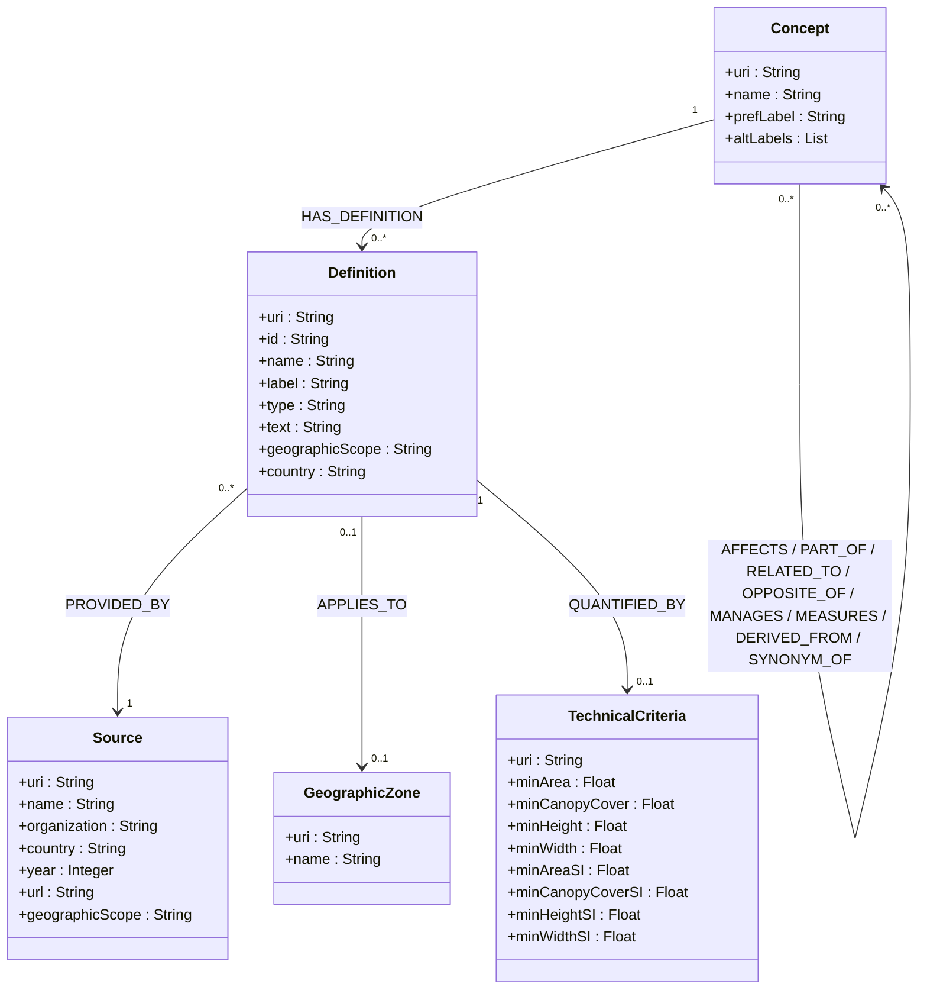

# Class Diagram — Version 2 (Actual Implementation)

This diagram reflects the model actually implemented in the CSV → RDF → Neo4j pipeline.

## Code Alignment Notes

### Concepts (18 total)
Extracted concepts from the document include:
- **Basic terms**: Forest, Tree, Woodland, Woods, Other Wooded Land, Non-forest, Stand, Grove, Thicket, Stocking
- **Action terms**: Deforestation, Afforestation, Reforestation, Forestation, Degradation, Regeneration
- **Management and products**: Forestry, Timber

### Properties
- `Concept` is created from `skos:Concept` with `prefLabel` and `altLabel`.
- `Definition` contains a short `label` (display), `text` (full content via `skos:note`), `geographicScope` (International/National/Local/State), and `country` (where this definition applies).
- `Source` includes `organization` (publishing organization), `country` (organization's country if applicable), `year`, `url`, and `geographicScope`.
- `Country` is a dedicated entity linked to definitions via `APPLIES_TO` for queries and graph visualizations.
- **Important distinction**: `Source.country` = country of the publishing organization (e.g., UN-FAO = International), `Definition.country` = country to which the definition applies (e.g., Brazil, Canada, etc.)
- `TechnicalCriteria` is an aggregated node (one entity per definition when criteria exist).

### Concept Relationships
Relationships use specialized semantic predicates:

**AFFECTS** (Actions affecting forests):
  - Deforestation → Forest
  - Afforestation → Forest
  - Reforestation → Forest
  - Forestation → Forest
  - Degradation → Forest
  - Regeneration → Forest

**PART_OF** (Forest components):
  - Tree → Forest
  - Stand → Forest
  - Grove → Forest
  - Thicket → Forest

**RELATED_TO** (Related land types):
  - Woodland → Forest
  - Woods → Forest
  - Other Wooded Land → Forest

**OPPOSITE_OF** (Opposites):
  - Non-forest → Forest

**MANAGES** (Management):
  - Forestry → Forest

**MEASURES** (Measurement):
  - Stocking → Forest

**DERIVED_FROM** (Products):
  - Timber → Tree

**SYNONYM_OF** (Synonyms - bidirectional):
  - Woodland ↔ Woods

### SI-Normalized Technical Criteria

The `*SI` properties in `TechnicalCriteria` contain values normalized to SI units to enable international comparisons:
- **minAreaSI**: Area in hectares (converted from acres: 1 acre = 0.404686 ha)
- **minHeightSI**: Height in meters (converted from feet: 1 foot = 0.3048 m)
- **minCanopyCoverSI**: Canopy cover in percent (already standard)
- **minWidthSI**: Width in meters (already in SI)

Original values are preserved in `minArea`, `minHeight`, etc.

**SI Statistics**:
- 1,532 normalized values
  - 533 heights (meters)
  - 428 areas (hectares)
  - 453 canopy covers (percent)
  - 118 widths (meters)

### Statistics
- **Concepts**: 18
- **Definitions**: 1,859
- **Sources**: 87
- **Countries**: 75
- **Technical Criteria**: 793
- **Relationships**: 5,794

Last updated: March 2, 2026
