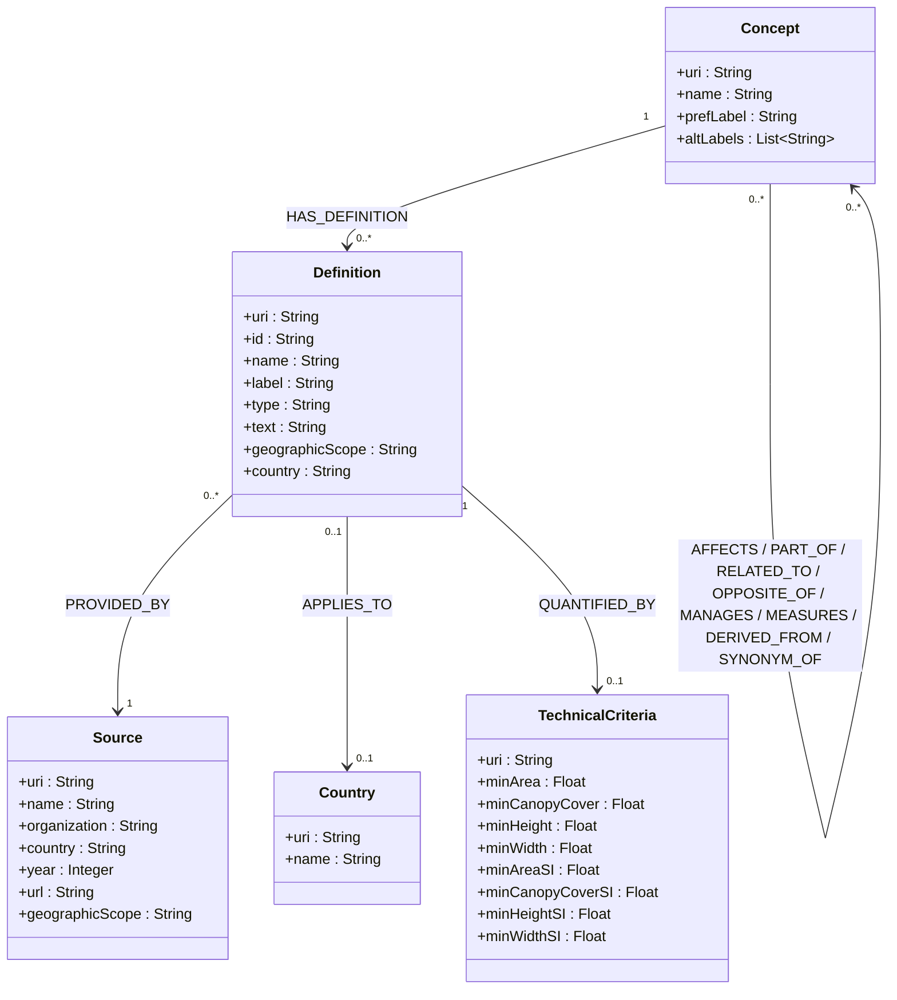

# Diagramme de Classe — Version 2 (Implémentation Réelle)

Ce diagramme reflète le modèle effectivement implémenté dans le pipeline CSV -> RDF -> Neo4j.

## Notes d'alignement avec le code

### Concepts (18 au total)
Les concepts extraits du document incluent :
- **Termes de base** : Forest, Tree, Woodland, Woods, Other Wooded Land, Non-forest, Stand, Grove, Thicket, Stocking
- **Termes d'action** : Deforestation, Afforestation, Reforestation, Forestation, Degradation, Regeneration
- **Gestion et produits** : Forestry, Timber

### Propriétés
- `Concept` est créé à partir de `skos:Concept` avec `prefLabel` et `altLabel`.
- `Definition` contient un `label` court (affichage), `text` (contenu complet via `skos:note`), `geographicScope` (International/National/Local/State), et `country` (où cette définition s'applique).
- `Source` inclut `organization` (l'organisme qui publie), `country` (pays de l'organisme si applicable), `year`, `url`, et `geographicScope`.
- `Country` est une entité dédiée liée aux définitions via `APPLIES_TO` pour les requêtes et visualisations graphe.
- **Distinction importante** : `Source.country` = pays de l'organisme publiant (ex: UN-FAO = International), `Definition.country` = pays auquel la définition s'applique (ex: Brazil, Canada, etc.)
- `TechnicalCriteria` est un noeud agrégé (une entité par définition quand des critères existent).

### Relations entre concepts
Les relations utilisent des prédicats sémantiques spécialisés :

**AFFECTS** (Actions affectant les forêts) :
  - Deforestation → Forest
  - Afforestation → Forest
  - Reforestation → Forest
  - Forestation → Forest
  - Degradation → Forest
  - Regeneration → Forest

**PART_OF** (Composantes des forêts) :
  - Tree → Forest
  - Stand → Forest
  - Grove → Forest
  - Thicket → Forest

**RELATED_TO** (Types de terrains apparentés) :
  - Woodland → Forest
  - Woods → Forest
  - Other Wooded Land → Forest

**OPPOSITE_OF** (Opposés) :
  - Non-forest → Forest

**MANAGES** (Gestion) :
  - Forestry → Forest

**MEASURES** (Mesure) :
  - Stocking → Forest

**DERIVED_FROM** (Produits) :
  - Timber → Tree

**SYNONYM_OF** (Synonymes - bidirectionnel) :
  - Woodland ↔ Woods

### Critères techniques normalisés SI

Les propriétés `*SI` dans `TechnicalCriteria` contiennent des valeurs normalisées en unités SI pour permettre des comparaisons internationales :
- **minAreaSI** : Surface en hectares (conversion depuis acres : 1 acre = 0.404686 ha)
- **minHeightSI** : Hauteur en mètres (conversion depuis pieds : 1 pied = 0.3048 m)
- **minCanopyCoverSI** : Couverture de canopée en pourcentage (déjà standard)
- **minWidthSI** : Largeur en mètres (déjà en SI)

Les valeurs originales sont préservées dans `minArea`, `minHeight`, etc.

**Statistiques SI** :
- 1,532 valeurs normalisées
  - 533 hauteurs (mètres)
  - 428 surfaces (hectares)
  - 453 couvertures de canopée (pourcentage)
  - 118 largeurs (mètres)

### Statistiques
- **Concepts** : 18
- **Définitions** : 1,859
- **Sources** : 87
- **Pays** : 75
- **Critères techniques** : 793
- **Relations** : 5,794

Dernière mise à jour : 2 mars 2026
