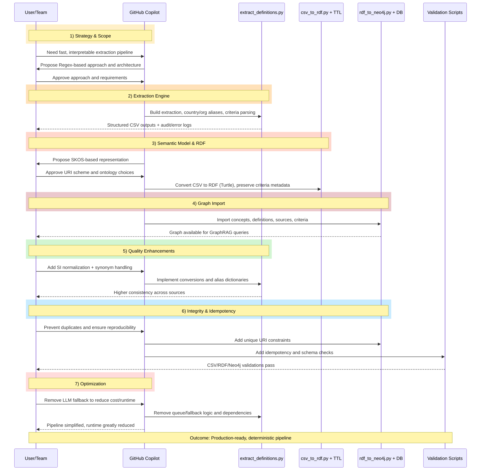

## Concise Sequence Diagram (Phases 1 to 16)

```mermaid
sequenceDiagram
    participant User as User/Team
    participant Agent as GitHub Copilot
    participant Extract as extract_definitions.py
    participant RDF as csv_to_rdf.py + TTL
    participant Neo4j as rdf_to_neo4j.py + DB
    participant Tests as Validation Scripts

    rect rgb(255, 240, 200)
    Note over User,Agent: 1) Strategy & Scope
    end
    User->>Agent: Need fast, interpretable extraction pipeline
    Agent->>User: Propose Regex-based approach and architecture
    User->>Agent: Approve approach and requirements

    rect rgb(255, 225, 185)
    Note over User,Extract: 2) Extraction Engine
    end
    Agent->>Extract: Build extraction, country/org aliases, criteria parsing
    Extract-->>User: Structured CSV outputs + audit/error logs

    rect rgb(255, 215, 205)
    Note over User,RDF: 3) Semantic Model & RDF
    end
    Agent->>User: Propose SKOS-based representation
    User->>Agent: Approve URI scheme and ontology choices
    Agent->>RDF: Convert CSV to RDF (Turtle), preserve criteria metadata

    rect rgb(235, 200, 205)
    Note over User,Neo4j: 4) Graph Import
    end
    Agent->>Neo4j: Import concepts, definitions, sources, criteria
    Neo4j-->>User: Graph available for GraphRAG queries

    rect rgb(210, 245, 210)
    Note over User,Extract: 5) Quality Enhancements
    end
    User->>Agent: Add SI normalization + synonym handling
    Agent->>Extract: Implement conversions and alias dictionaries
    Extract-->>User: Higher consistency across sources

    rect rgb(200, 235, 255)
    Note over User,Neo4j: 6) Integrity & Idempotency
    end
    User->>Agent: Prevent duplicates and ensure reproducibility
    Agent->>Neo4j: Add unique URI constraints
    Agent->>Tests: Add idempotency and schema checks
    Tests-->>User: CSV/RDF/Neo4j validations pass

    rect rgb(255, 220, 220)
    Note over User,Agent: 7) Optimization
    end
    User->>Agent: Remove LLM fallback to reduce cost/runtime
    Agent->>Extract: Remove queue/fallback logic and dependencies
    Agent-->>User: Pipeline simplified, runtime greatly reduced

    Note over User,Tests: Outcome: Production-ready, deterministic pipeline
```
